# 📊 Explorative Datenanalyse: Online-Retail-Verkaufsdaten

Ein vollständiges EDA-Portfolio-Projekt: von der Datengenerierung über die Bereinigung bis
zur explorativen Analyse mit Visualisierungen — modular, dokumentiert und reproduzierbar.


---

## 📘 Einführung

In der heutigen datengetriebenen Wirtschaft ist die Fähigkeit, große und unstrukturierte
Datensätze systematisch zu untersuchen, eine Kernkompetenz jedes Data Analysten. Dieses
Projekt zeigt exemplarisch, wie aus rohen, fehlerbehafteten Verkaufsdaten eines fiktiven
Online-Händlers durch einen strukturierten Workflow — angelehnt an den CRISP-DM-Standard —
verwertbare geschäftliche Erkenntnisse gewonnen werden. Dabei werden typische Herausforderungen
wie fehlende Werte, Duplikate, inkonsistente Kategorien und Ausreißer nicht nur erkannt,
sondern auch nachvollziehbar bereinigt. Das Ergebnis ist eine saubere Datenbasis, die als
Fundament für weiterführende Analysen, Dashboards oder Machine-Learning-Modelle dient und
gleichzeitig als reproduzierbares Portfolio-Stück fungiert.

---


## 🎯 Projektziel

Dieses Projekt demonstriert einen vollständigen, professionellen EDA-Workflow anhand eines
(synthetischen) E-Commerce-Verkaufsdatensatzes: Datenqualität prüfen, bereinigen und zentrale
Geschäftsfragen zu Umsatz, Produktkategorien, Regionen, Rabatten und Retouren beantworten.

Den ausführlichen Projektplan mit Leitfragen und Methodik findest du unter
[`docs/PROJEKTPLAN.md`](docs/PROJEKTPLAN.md).

---

## 🏗️ Architektur

Das folgende Diagramm veranschaulicht den Datenfluss des Projekts — von der Erzeugung der
Rohdaten bis zum exportierten Report:

```mermaid
graph LR
    A[generate_data.py] -->|Erzeugt| B[(data/raw/<br>online_retail_sales.csv)]
    B -->|Lädt| C[data_loader.py<br>clean_data]
    C -->|Bereinigt| D[(data/processed/<br>sales_clean.csv)]
    D -->|Analysiert| E[eda_utils.py<br>plot & analyze]
    E -->|Visualisiert| F[notebooks/01_eda.ipynb]
    F -->|Exportiert| G[reports/figures/<br>*.png]
    
    style A fill:#e3f2fd,stroke:#1976d2,stroke-width:2px
    style B fill:#fff3e0,stroke:#f57c00,stroke-width:2px
    style C fill:#e8f5e9,stroke:#388e3c,stroke-width:2px
    style D fill:#fff3e0,stroke:#f57c00,stroke-width:2px
    style E fill:#fce4ec,stroke:#c2185b,stroke-width:2px
    style F fill:#f3e5f5,stroke:#7b1fa2,stroke-width:2px
    style G fill:#e0f2f1,stroke:#00796b,stroke-width:2px

```



## 🗂️ Projektstruktur

```
eda-projekt/
├── README.md                   # Diese Datei
├── requirements.txt             # Python-Abhängigkeiten
├── LICENSE                      # MIT-Lizenz
├── .gitignore
├── docs/
│   └── PROJEKTPLAN.md           # Detaillierter Projektplan
├── data/
│   ├── raw/                     # Rohdaten (unverändert, generiert)
│   └── processed/                # Bereinigte Daten (Output der Pipeline)
├── src/
│   ├── generate_data.py         # Erzeugt den synthetischen Rohdatensatz
│   ├── data_loader.py           # Laden & Bereinigen der Daten
│   └── eda_utils.py             # Wiederverwendbare Plot-/Analysefunktionen
├── notebooks/
│   └── 01_eda.ipynb             # Vollständige EDA (bereits ausgeführt, mit Outputs)
└── reports/
    └── figures/                  # Exportierte Diagramme (PNG)
```

## 📦 Datensatz

Da für ein öffentliches Portfolio-Projekt keine echten Kundendaten verwendet werden sollen,
wird ein **synthetischer, aber realistisch modellierter** Online-Retail-Datensatz erzeugt
(`src/generate_data.py`, 5.000+ Bestellungen, 2023–2024). Er enthält absichtlich typische
Datenqualitätsprobleme:

- fehlende Werte (Alter, Bewertung, Versandkosten)
- Duplikate
- inkonsistente Schreibweisen bei Kategorien
- unplausible Werte (z. B. negative Mengen)
- Preis-Ausreißer

Dadurch lässt sich der komplette EDA-Workflow inklusive Datenbereinigung realistisch zeigen.
Die Methodik ist 1:1 auf echte Datensätze übertragbar.

**Spalten (Auszug):** `order_id`, `order_date`, `customer_id`, `customer_age`,
`customer_region`, `product_category`, `product_name`, `quantity`, `unit_price`,
`discount_percent`, `payment_method`, `shipping_cost`, `delivery_days`, `customer_rating`,
`is_returned`

## 🚀 Schnellstart

```bash
# 1. Repository klonen
git clone https://github.com/<dein-username>/eda-projekt.git
cd eda-projekt

# 2. Virtuelle Umgebung anlegen (empfohlen)
python -m venv venv
source venv/bin/activate      # Windows: venv\Scripts\activate

# 3. Abhängigkeiten installieren
pip install -r requirements.txt

# 4. Rohdatensatz generieren
python src/generate_data.py

# 5. Bereinigte Daten erzeugen (optional, wird auch im Notebook gemacht)
python src/data_loader.py

# 6. Notebook öffnen und ausführen
jupyter notebook notebooks/01_eda.ipynb
```

## 🔍 Analyseschritte im Notebook

1. **Daten laden & Überblick verschaffen** — Struktur, Datentypen, Kennzahlen
2. **Datenqualität prüfen** — fehlende Werte, Duplikate, inkonsistente Kategorien
3. **Datenbereinigung** — mit dokumentierter, wiederverwendbarer Logik (`src/data_loader.py`)
4. **Univariate Analyse** — Verteilungen numerischer und kategorialer Variablen
5. **Zeitreihenanalyse** — Umsatzentwicklung über die Monate
6. **Bivariate/multivariate Analyse** — Korrelationen, Umsatz nach Kategorie/Region,
   Rabatt vs. Retourenquote
7. **Ausreißererkennung** — IQR-Methode für Preise und Lieferzeiten
8. **Zusammenfassung** — zentrale Erkenntnisse & Ausblick

## 📈 Beispielhafte Ergebnisse

| Diagramm | Beschreibung |
|----------|--------------|
| `reports/figures/missing_values.png` | Übersicht fehlender Werte je Spalte |
| `reports/figures/distributions.png` | Verteilungen numerischer Variablen |
| `reports/figures/correlation_heatmap.png` | Korrelationsmatrix numerischer Variablen |
| `reports/figures/revenue_over_time.png` | Monatliche Umsatzentwicklung |
| `reports/figures/revenue_by_category.png` | Umsatz nach Produktkategorie |
| `reports/figures/return_rate_by_discount.png` | Retourenquote nach Rabattstufe |
| `reports/figures/boxplot_unit_price.png` | Preisverteilung & Ausreißer je Kategorie |

## 🧠 Zentrale Erkenntnisse (Zusammenfassung)

- Der Rohdatensatz enthielt fehlende Werte, Duplikate und inkonsistente Kategoriewerte —
  diese wurden systematisch bereinigt (`clean_data()` in `src/data_loader.py`).
- Umsatzstärkste Kategorien sind Elektronik und Haushalt.
- Der monatliche Umsatz zeigt erkennbare saisonale Schwankungen.
- Höhere Rabattstufen gehen tendenziell mit einer leicht erhöhten Retourenquote einher.
- Einzelne Bestellungen weisen stark überhöhte Preise auf (mögliche Erfassungsfehler) und
  sollten vor einer produktiven Weiterverarbeitung geprüft werden.

Die vollständige, ausführliche Analyse inkl. aller Diagramme befindet sich im Notebook
[`notebooks/01_eda.ipynb`](notebooks/01_eda.ipynb).

## 🛠️ Verwendete Technologien

- Python 3.11
- pandas, numpy — Datenverarbeitung
- matplotlib, seaborn — Visualisierung
- Jupyter Notebook — interaktive Analyse

## 🔭 Mögliche Erweiterungen

- Interaktives Dashboard (z. B. Streamlit/Plotly Dash)
- Umsatzprognosemodell (Zeitreihenmodell)
- Klassifikationsmodell zur Retourenvorhersage
- RFM-/Kohortenanalyse der Kunden

## 📄 Lizenz

Dieses Projekt steht unter der [MIT-Lizenz](LICENSE).

## 👤 Autor

Erstellt von [Dein Name] — Data Engineer.
Feedback und Pull Requests sind willkommen!
